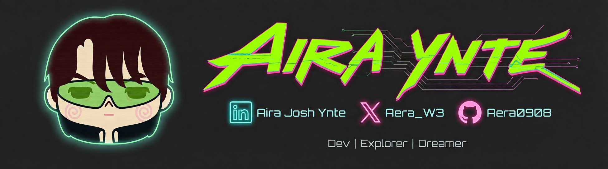
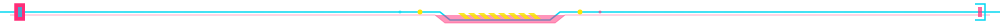
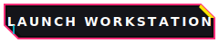
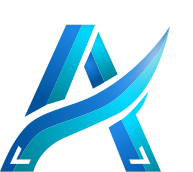
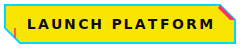

  

### `> NETRUNNER CONSOLE STATUS`

<table align="center">
<tr>
<td>
<pre>
=============================================================================
[ DECK OWNER: AIRA JOSH ]   [ OS: NEURAL_OS v4.26 ]   [ STATUS: OVERCLOCKED ]
=============================================================================
> SYSTEM SPECS:
  - CYBERDECK   : Custom ESP32-S3 hardware array (Flame Engine core)
  - NEURAL LINK : EIP-1193 MetaMask Integration Core
  - COGNITIVE   : 256GB Neural RAM (Ultra-low Latency)
  - GRID ADAPTR : Web3 Payment Rails (Morph L2 Interface)

> CURRENT ACTIVE DIRECTIVES:
  - HACKING     : Enhancing Fehuvia B2B treasury workstation microservices
  - TRAINING    : Optimizing real-time MediaPipe motion tracking for AeroVit
  - RESEARCHING : Reviewing advanced Solidity gas structures & Morph L2 fees
=============================================================================
</pre>
</td>
</tr>
</table>

## `> WORK HISTORY`

| Role                                  | Organization                             |     Period     |
| :------------------------------------ | :--------------------------------------- | :------------: |
| IC Design Intern (OJT)                | Xinyx Design Consultancy & Services Inc. |      2025      |
| Freelance Web3 & Full-Stack Developer | Various Clients                          | 2023 – Present |

**Xinyx** — Designed & verified AMBA APB3 peripheral interfaces in SystemVerilog RTL; IC design workflows & circuit simulation.

**Freelance** — Web2/Web3 dashboards, PostgreSQL schema optimization, Node.js/Express microservices, MetaMask EIP-1193, crypto payment rails.

## `> COMPLETED MISSIONS`

  

### `// FEATURED NEURAL PROJECTS`

<table align="center" width="100%">
<tr>
<td align="center" width="50%" valign="top">

 

<h3><b>FEHUVIA</b></h3>

<code>Web3 B2B Treasury Workstation</code>

**Stack:** React 19, Solidity, Morph L2, PostgreSQL

* Automated crypto payment rails
* Multi-signature wallet workflows
* Smart contract gas optimization

 

  

</td>
<td align="center" width="50%" valign="top">

 

<h3><b>AEROVIT</b></h3>

<code>Gamified AI Fitness Platform</code>

**Stack:** Flutter, ESP32-S3, Flame, MediaPipe

* Real-time AI-driven motion tracking
* Bluetooth IoT sensor integration
* ERC-20 token rewards gamification

 

  

</td>
</tr>
</table>

  

### `// COMPLETE REGISTRY`

| Project                                                            | Stack                                            |     Year     |
| :----------------------------------------------------------------- | :----------------------------------------------- | :----------: |
| [**Fehuvia**](https://fehuvia.app) — Web3 B2B Treasury Workstation | React 19, Solidity, Morph L2, PostgreSQL, GPT-4o |     2026     |
| [**AeroVit**](https://aerovit.dev) — Gamified AI Fitness Platform  | Flutter, ESP32-S3, MediaPipe, Flame 2D, ERC-20   |  2024–2026   |
| **Plant.io** — 8-bit IoT Nursery Dashboard                         | Flutter, Firebase RTDB, ESP32, Open-Meteo        |     2025     |
| **The Safehouse** — 3D Scroll Narrative Site                       | React 19, Three.js, R3F, GSAP, Lenis, Rive       | 2025–Present |
| **Student Consultation System** — Full-Stack Portal                | React, TypeScript, Node.js, PostgreSQL, JWT      |     2025     |
| **Walang Basagan ng Thrift** — Y2K E-commerce                      | React 19, TypeScript, Node.js, SQLite            |     2025     |
| **EMG Interface Controller** — Hardware + CV                       | ESP32-S3, C/C++, Python, KiCad, Fusion 360       |   Academic   |
| **Manhwa Reader** — SPA Web App                                    | React 19, TypeScript, Vite, MangaDex API         |     2026     |

## `> SYSTEM TELEMETRY`

<table align="center" width="100%">
<tr>
<td align="center" width="50%" valign="top">

</td>
<td align="center" width="50%" valign="top">

</td>
</tr>
</table>

## `> CYBERWARE — TECH STACK`

<table align="center">
<tr>
<td valign="top" align="center" width="25%">

**`[ LANGUAGES ]`**

</td>
<td valign="top" align="center" width="25%">

**`[ FRONTEND ]`**

</td>
<td valign="top" align="center" width="25%">

**`[ BACKEND & DB ]`**

</td>
<td valign="top" align="center" width="25%">

**`[ HARDWARE & AI ]`**

</td>
</tr>
</table>

## `> CREDENTIALS`

| Certificate                    | Issuer                         |
| :----------------------------- | :----------------------------- |
| On-the-Job Training            | Xinyx Design Engineering, Inc. |
| TINA Design Suite Workshop     | Hytec Power, Inc.              |
| The AI Engineer Path           | Scrimba                        |
| Learn React                    | Scrimba                        |
| Learn TailwindCSS              | Scrimba                        |
| Blockchain4Youth               | Bitget                         |
| Understanding EDR              | Cybersecurity Training         |
| Basic Web Development Workshop | Zuitt                          |

 

